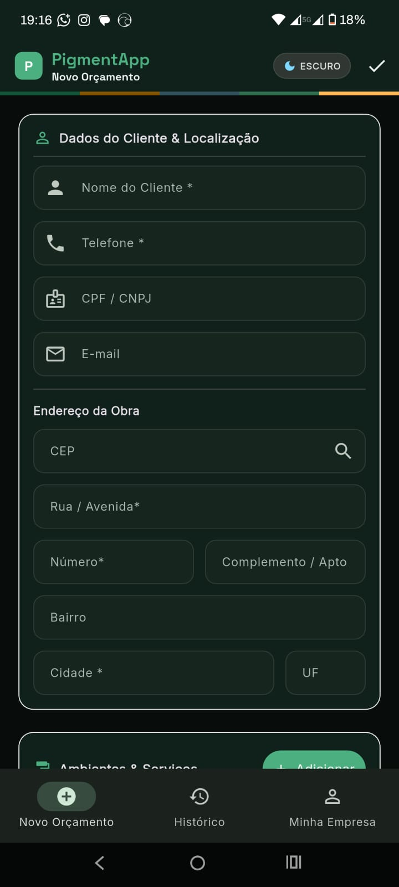
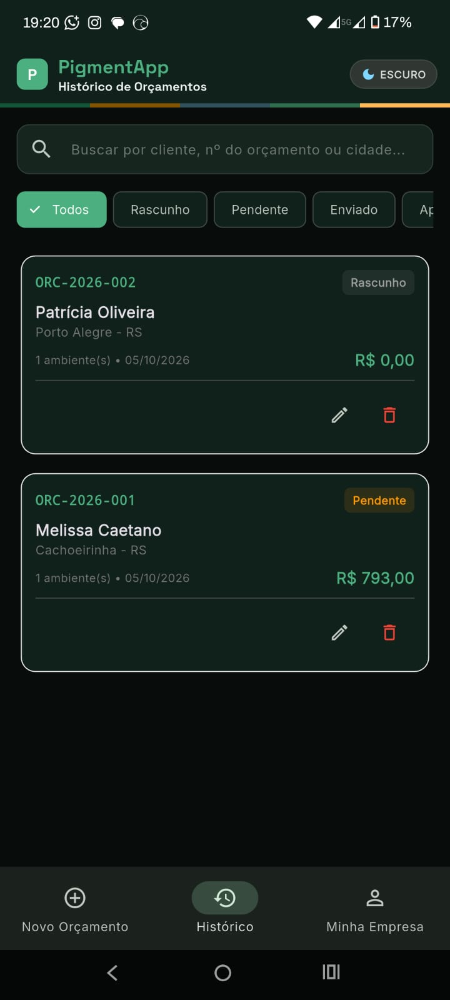
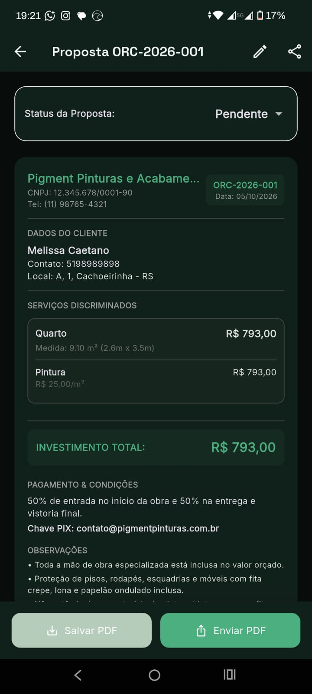
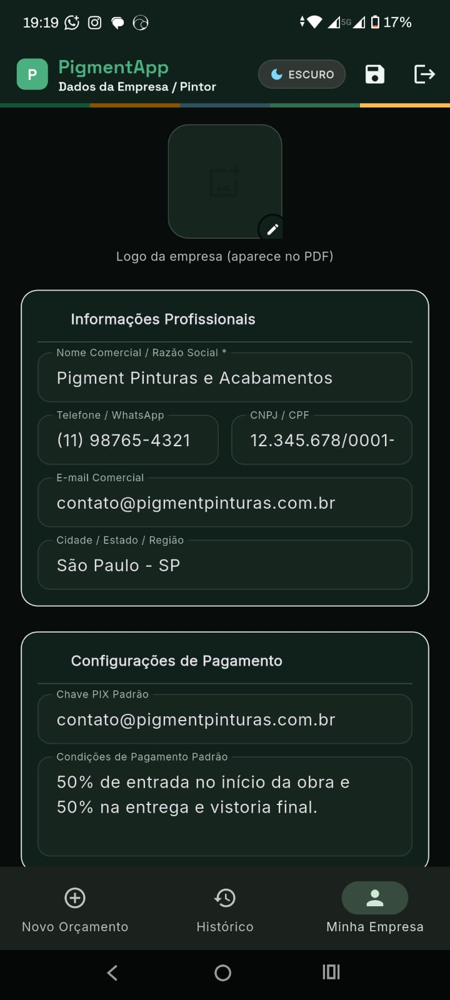

<h1 align="center">🎨 PigmentaApp</h1>

  Orçamentos profissionais em PDF para pintores. Rápido, simples e sem papel.

  
  

  
  
  
  

> ⚠️ O código-fonte deste projeto é privado. Este repositório apresenta o app, suas funcionalidades e as telas.

---

## 📖 Sobre o projeto

Muitos pintores e aplicadores ainda fazem orçamento no papel, na calculadora ou em planilhas mal formatadas, e acabam enviando propostas sem padrão, perdidas em conversas de WhatsApp.

O **PigmentaApp** resolve isso: o profissional monta o orçamento completo pelo celular, em minutos, e envia um PDF com a identidade visual da própria empresa.

## ✨ Funcionalidades

- 🧮 Cálculo por **m²**, **diária** ou **empreitada** (valor fechado)
- 🚗 Cálculo automático de deslocamento por km e dias trabalhados
- 📄 Proposta em **PDF** com logo e dados da empresa
- 💬 Envio pelo **WhatsApp** ou compartilhamento do PDF
- 🗂 Histórico com busca, filtro por status (pendente, enviado, aprovado, rejeitado) e exclusão com confirmação
- 🏢 Perfil da empresa cadastrado uma vez e reaproveitado nos orçamentos (logo, PIX, condições padrão)
- 📍 Preenchimento automático de endereço pelo CEP
- 🔐 Login com e-mail, senha e recuperação de senha
- ☁️ Dados sincronizados na nuvem em tempo real
- 🌓 Tema claro e escuro

## 📸 Telas

  
  
  
  

## 🏗 Arquitetura

App Android em **Flutter** que usa o **Firebase** como back-end, sem servidor próprio:

- **Authentication** controla o acesso (e-mail/senha e Google)
- **Cloud Firestore** guarda perfil e orçamentos separados por usuário, com atualização em tempo real
- **Storage** guarda o logo da empresa
- **Hosting** serve o site institucional, com Termos de Uso e Política de Privacidade
- O estado do app é gerenciado com **Provider**, e a geração do PDF acontece no próprio dispositivo

## 🛠 Tecnologias

- **Mobile:** Flutter, Dart, Provider
- **Back-end (BaaS):** Firebase Authentication, Cloud Firestore, Firebase Storage, Firebase Hosting
- **Bibliotecas:** pdf, printing, share_plus, url_launcher, image_picker
- **Integrações:** API ViaCEP, WhatsApp
- **Ferramentas:** Git, GitHub, VS Code

## 👨‍💻 Meu papel

Desenvolvi o projeto de ponta a ponta: ideia, app, modelagem dos dados, publicação na Google Play e site institucional. Alguns desafios que resolvi:

- **Sincronização em tempo real:** os listeners do Firestore são reiniciados a cada troca de usuário, para nunca misturar dados de contas diferentes.
- **Geração de PDF no dispositivo:** layout profissional com várias páginas, cabeçalho e o logo da empresa baixado do Storage.
- **Numeração automática:** propostas com código sequencial por ano (ex.: ORC-2026-001).
- **Cadastro rápido:** busca de endereço por CEP via ViaCEP para agilizar o preenchimento.

## 🔗 Links

- 📱 [PigmentaApp na Google Play](https://play.google.com/store/apps/details?id=com.juniorpfo.pigmentapp)
- 🌐 [Site oficial](https://pigmentapp-prod.web.app)
- 🔒 [Política de Privacidade](https://pigmentapp-prod.web.app/privacidade.html)
- 📜 [Termos de Uso](https://pigmentapp-prod.web.app/termos.html)

## 📫 Contato

[LinkedIn](https://www.linkedin.com/in/paulofojunior) · [junior.pfo@gmail.com](mailto:junior.pfo@gmail.com)
